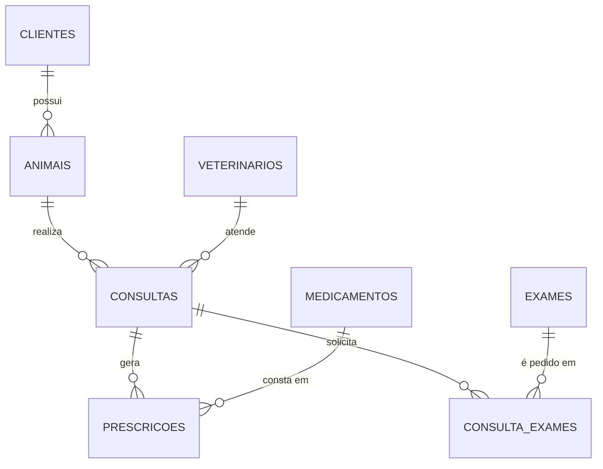

# Banco de Dados - Clínica Veterinária

Este repositório reúne o script SQL de um banco de dados para uma clínica veterinária. A ideia é organizar em um só lugar o que acontece no dia a dia de uma clínica: quem são os tutores, quais animais são atendidos, quem atendeu, o que foi receitado e quais exames foram pedidos.

O projeto foi desenvolvido em **MariaDB**, utilizando principalmente o **DBeaver** para escrever e executar os comandos. O script completo está no arquivo `Banco_Veterinaria.sql`. Todos os dados de exemplo (nomes, CPFs, telefones, endereços) são fictícios e servem apenas para testar as consultas.

## O que tem no script

O arquivo está dividido em seções, na seguinte ordem:

1. Criação do banco de dados `veterinaria`
2. Criação das tabelas
3. Inserção de dados de exemplo
4. Atualizações (`UPDATE`)
5. Exclusões (`DELETE`)
6. Relatórios (`SELECT`)
7. Triggers de validação

## Modelo de dados

O banco tem 8 tabelas. O fluxo principal é: um **cliente** tem **animais**, cada animal passa por **consultas** com um **veterinário**, e cada consulta pode gerar **prescrições** de medicamentos e pedidos de **exames**.



Se você usa o DBeaver, também dá para ver o diagrama gerado a partir do próprio banco: depois de criar as tabelas, abra o schema `veterinaria`, clique com o botão direito em "Tables" e escolha a opção de diagrama ER.

### Tabelas

| Tabela | Para que serve | Principais campos |
|---|---|---|
| `clientes` | Tutores dos animais | `nome`, `cpf`, `telefone`, `endereco` |
| `animais` | Pacientes da clínica | `nome`, `idade`, `especie`, `raca`, `idclientes` |
| `veterinarios` | Profissionais que atendem | `nome`, `crmv`, `especialidade` |
| `consultas` | Cada atendimento realizado | `data_consulta`, `idanimais`, `idveterinario` |
| `medicamentos` | Catálogo de medicamentos | `nome`, `modalidade`, `indicacao`, `data_validade`, `laboratorio` |
| `prescricoes` | Medicamento receitado em uma consulta | `data_prescricao`, `data_fim`, `idconsulta`, `idmedicamento` |
| `exames` | Catálogo de exames disponíveis | `nome`, `modalidade` |
| `consulta_exames` | Exames pedidos em cada consulta e seus resultados | `idconsulta`, `idexame`, `resultado`, `data_resultado` |

### Algumas decisões de modelagem

- **`consulta_exames`** é uma tabela associativa: uma consulta pode ter vários exames e um mesmo exame pode ser pedido em várias consultas. Por isso a chave primária é composta por `idconsulta` e `idexame`.
- **`data_fim` em `prescricoes`** pode ficar nulo. Quando isso acontece, significa que o tratamento é contínuo, sem data para terminar.
- **`resultado` e `data_resultado` em `consulta_exames`** também podem ficar nulos, o que indica que o exame foi solicitado mas o resultado ainda não foi lançado.
- **`data_consulta` e `data_prescricao`** usam a data e hora atuais como valor padrão quando nenhuma é informada.
- Um cliente pode ter mais de um animal, e um animal pode ter várias consultas em datas diferentes.

## Como executar

### Pelo DBeaver

1. Crie uma conexão com o MariaDB (Banco de Dados > Nova Conexão > MariaDB) e informe host, porta, usuário e senha.
2. Abra um novo script SQL (`Ctrl + ]`) ou use Arquivo > Abrir Arquivo para carregar o `Banco_Veterinaria.sql`.
3. Execute o **script inteiro** com `Alt + X`. Cuidado para não usar `Ctrl + Enter`, que executa só o comando onde o cursor está.
4. Ao terminar, atualize o navegador de bancos (`F5`) para o schema `veterinaria` aparecer na lista.

Uma dica sobre os triggers: o script usa `delimiter //` para criá-los, e o DBeaver entende esse comando normalmente. Mesmo assim, se aparecer algum erro de sintaxe justamente na criação de um trigger, vale conferir a configuração de "Blank line is statement delimiter" (em Janela > Preferências > Editores > Editor SQL > Processamento SQL). Como os corpos dos triggers têm linhas em branco, essa opção pode cortar o comando no meio se estiver ativada de forma estrita.

### Pelo terminal

Também é possível rodar o script pela linha de comando:

```bash
mariadb -u seu_usuario -p < Banco_Veterinaria.sql
```

Em instalações mais antigas, o cliente pode se chamar `mysql` em vez de `mariadb`.

### Versão do MariaDB

Os recursos usados no script, como `SIGNAL` nos triggers e o operador `<=>`, existem no MariaDB há bastante tempo, então qualquer versão 10.x ou mais recente deve funcionar sem problemas.

### Rodando mais de uma vez

O script começa com `create database veterinaria;` sem verificação de existência. Se você já tiver um banco com esse nome, ele vai dar erro. Para rodar novamente do zero, execute antes:

```sql
drop database if exists veterinaria;
```

Se os acentos aparecerem quebrados nos dados (por exemplo "Jo?o" no lugar de "João"), o banco provavelmente foi criado com uma codificação que não é UTF-8. Nesse caso, crie o banco assim:

```sql
create database veterinaria character set utf8mb4 collate utf8mb4_general_ci;
```

## Dados de exemplo

Depois de rodar a seção de inserts, o banco fica com os valores abaixo. Ao final do script, depois da seção de exclusões, ele termina com 9 clientes, 10 animais, 12 consultas, 15 prescrições e 11 registros em `consulta_exames`.

- 10 clientes
- 12 animais (cães e gatos de diversas raças)
- 10 veterinários de especialidades variadas (clínica geral, dermatologia, cirurgia, cardiologia, entre outras)
- 15 consultas
- 10 medicamentos
- 16 prescrições (12 no primeiro lote e 4 em um lote adicional, criado depois para deixar os relatórios mais interessantes)
- 10 exames
- 12 registros em `consulta_exames`, alguns já com resultado e outros ainda pendentes

## Atualizações e exclusões

A seção de `UPDATE` faz pequenos ajustes de exemplo, como corrigir a idade de um animal, renomear um medicamento, lançar o resultado de um exame pendente, alterar um endereço e definir a data de fim de uma prescrição.

A seção de `DELETE` remove o cliente de código 2 e tudo que depende dele. Como as tabelas têm chaves estrangeiras, a exclusão precisa seguir uma ordem: primeiro os exames das consultas, depois as prescrições, depois as consultas, depois os animais (códigos 3 e 12) e, por fim, o cliente. Se essa ordem for invertida, o banco recusa a operação.

## Relatórios

O script traz cinco consultas prontas, cada uma com um comentário explicando para que ela serve. No DBeaver, basta posicionar o cursor dentro da consulta e executar com `Ctrl + Enter` para ver o resultado na grade.

1. **Animais de meia idade**: lista os animais com 5 a 9 anos, ordenados pela idade. Ajuda a planejar check-ups preventivos.
2. **Modalidades de exame mais comuns**: agrupa os exames por modalidade e mostra apenas as que têm mais de 2 exames cadastrados (usa `GROUP BY` e `HAVING`).
3. **Histórico de consultas**: mostra veterinário, animal, data e cliente de cada consulta, usando junções feitas na cláusula `WHERE`.
4. **Painel completo por consulta**: cruza consulta, animal, veterinário, exame e resultado com `INNER JOIN` e `LEFT JOIN`, de modo que consultas sem exames também aparecem.
5. **Medicamentos nunca prescritos**: usa uma subconsulta com `NOT IN` para encontrar medicamentos parados no cadastro, útil para o controle de estoque e de validade.

## Triggers

Três triggers garantem a consistência dos dados diretamente no banco:

| Trigger | Tabela / evento | O que faz |
|---|---|---|
| `Impedir_duplicidade_CRMV` | `veterinarios` / antes de inserir | Bloqueia o cadastro de um veterinário com CRMV que já existe |
| `verifica_idade_animal` | `animais` / antes de inserir | Impede o cadastro de um animal com idade negativa |
| `trava_resultado_exames` | `consulta_exames` / antes de atualizar | Impede que um resultado já lançado seja alterado ou apagado |

A regra do terceiro trigger é a seguinte: se o exame já tem resultado, ele fica travado, e a orientação é realizar um novo exame. Ainda é possível preencher um resultado que estava vazio e alterar campos como `data_resultado`.

No final do script existem blocos de teste comentados para cada trigger. Para experimentar, basta remover os comentários e executar. Os testes do terceiro trigger usam `START TRANSACTION` e `ROLLBACK`, então nada é alterado de forma definitiva. Ao testar no DBeaver, selecione e execute o bloco inteiro de uma vez (`Alt + X`), para que o `START TRANSACTION` e o `ROLLBACK` rodem na mesma sessão.

Quando um trigger bloqueia uma operação, o DBeaver mostra a mensagem de erro definida no script (por exemplo, "Erro: O CRMV não pode ser duplicado."), com o código SQLSTATE 45000.

## Observações

- Os triggers são criados no final do script, depois dos inserts e updates. Por isso, os dados de exemplo não passam pela validação deles.
- Os campos `cpf` e `telefone` são texto simples, sem validação de formato.

## Ideias para evoluir o projeto

- Criar uma tabela de agendamentos, separada das consultas realizadas
- Adicionar controle de estoque de medicamentos
- Incluir um trigger de validação de idade também para atualizações
- Criar views para os relatórios mais usados
- Adicionar dosagem e frequência nas prescrições
